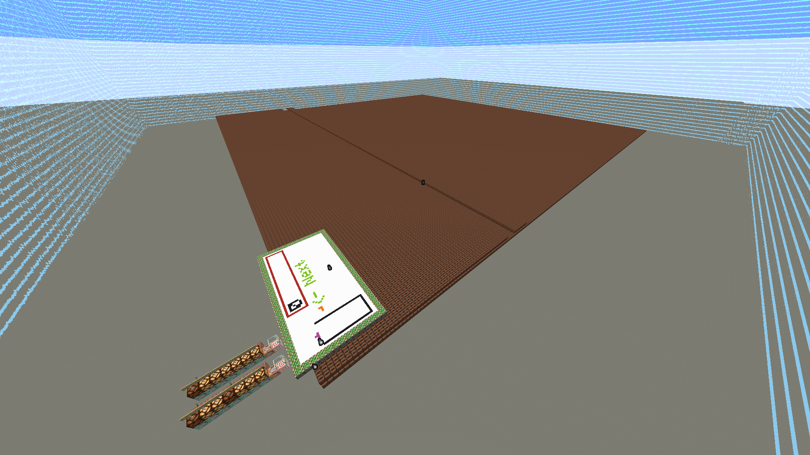

**MCMulator PC v7** is an execution enviroment for [**IGB Binary**](https://github.com/krypciak/IGB-Compiler-L1).  

For architecture explanations, see [**IGB VM**](https://github.com/krypciak/IGB-VM).  

You can write programs for it using the [**IGB L2**](https://github.com/krypciak/IGB-Compiler-L2) programming language.

# Example programs:  
## [Tetris](https://github.com/krypciak/IGB-VM/tree/main/IGB/L2/tetris)

   

## Screen
<ul>
  <li><strong>RGB</strong>
    <ul>
       <li>Max size: 240x240 (block entity render distance limit)</li>
       <li>Colors: RGB, ~16 million colors</li>
    </ul>
  </li>
  <li><strong>16 color palette</strong>
    <ul>
      <li>Max size: ????</li>
      <li>Colors:&nbsp;  white, yellow, orange, red, magenta, purple, blue, light blue, lime, green, brown,</li>
      cyan, light gray, pink, gray, black (Minecraft concrete colors)
    </ul>
   </li>
</ul>
 

## Storage

In MCMPCv7, storage is based on <strong>NBT</strong>. There are no bits or bytes, only integers. Integers are stored in jukeboxes.  
Data is accessed by an NBT path: **RecordItem.tag.a**  
The position of the armor stand reading data is calculated with this equation:  
x = cell % storageWidth,&nbsp; z = cell / storageWidth  

#### PES (Program Execution Space) (you may call it ROM)
PES is where instructions are stored.  
It has a fixed size of 251x251 (63001)
#### RAM
It has a fixed size of 251x251 (63001)

 

### Screenshots

# License
Licensed under GNU GPLv3 or later
